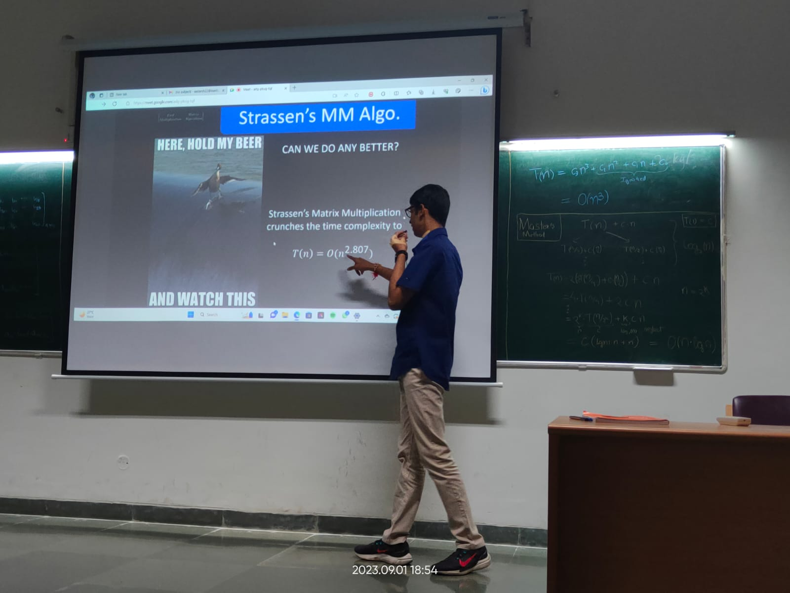
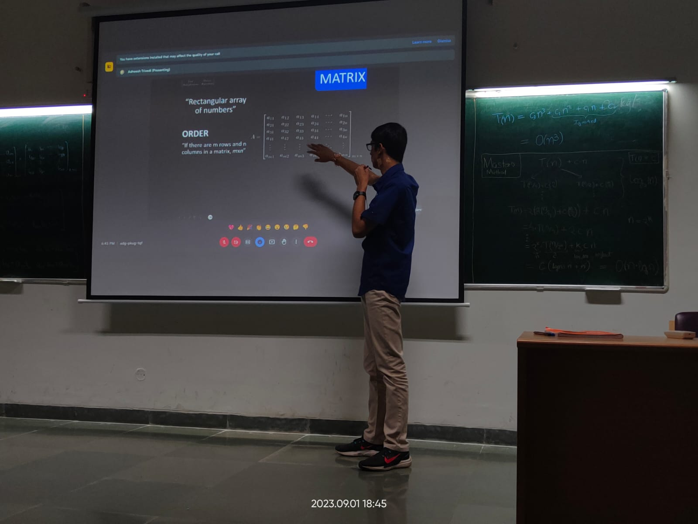
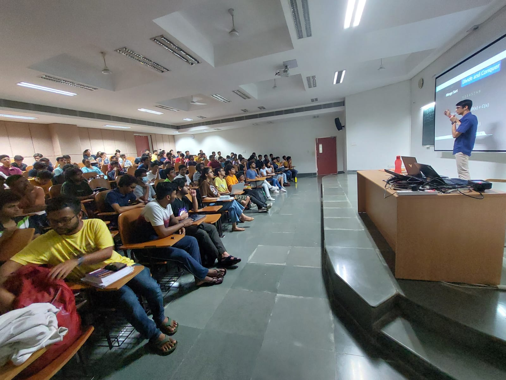

# What is here?

```tree
|   Banner.png          Banner that was circulated for advertising talk.
|   FMMA.pptx           PPT used to present the topic
|   manim.ipynb         Playground where I created all Manims used for presenting.
|   README.md           This file u reading.
|   strassen.pdf        An article for further reading
|   StrassensAlgo.py    My implementation of SMM on python
|   
>---src                 My implementation of SMM on c++ (WIP)
         main.cpp
         main.exe
         matrix.h
```

# Images for memories



